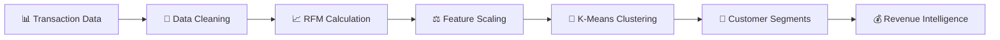

# 🛒💡 RETAIL RADAR ENGINE 💡🛒

[](https://git.io/typing-svg)

<p align="center">
  
  
  
  
  
</p>

<p align="center">
  <a href="https://retail-radar-engine-project.streamlit.app/">
    
  </a>
  <a href="https://github.com/mayank-goyal09/retail-radar-engine/stargazers">
    
  </a>
  <a href="https://github.com/mayank-goyal09/retail-radar-engine/network">
    
  </a>
</p>

<p align="center">
  
</p>

### 🎯 **Segment customers like a retail genius** using **RFM + K-Means ML** 🤖
### 📊 Transaction Data × AI = **Revenue Intelligence** 💰

---

## 🌟 **WHAT IS THIS?** 🌟

<table>
<tr>
<td>

### 🛒 **The Magic**

This **ML-powered customer segmentation engine** analyzes retail transaction data using **RFM Analysis** and **K-Means Clustering** to identify high-value vs low-value customers. Upload your sales data and get instant, actionable insights!

**Think of it as:**
- 🧠 Brain = K-Means Clustering  
- 📊 Input = Transaction History  
- 🎯 Output = Customer Segments  

</td>
<td>

### ⚡ **Key Features**

✅ RFM Analysis (Recency, Frequency, Monetary)  
✅ K-Means customer clustering  
✅ 3D interactive visualizations  
✅ Revenue intelligence dashboard  
✅ CSV export for campaigns  
✅ Beautiful Streamlit UI  

</td>
</tr>
</table>

---

## 🛠️ **TECH STACK** 🛠️

<p align="center">
  
</p>

| **Category**       | **Technologies**                        |
|--------------------|-----------------------------------------|
| 🐍 **Language**     | Python 3.8+                             |
| 📊 **Data Science** | Pandas, NumPy, Scikit-learn             |
| 🎨 **Frontend**     | Streamlit                               |
| 📈 **Visualization**| Plotly, Matplotlib, Seaborn             |
| 🧪 **Model**        | K-Means Clustering, StandardScaler      |
| 💾 **Serialization**| Joblib                                  |

---

## 📂 **PROJECT STRUCTURE** 📂

```
🛒 retail-radar-engine/
│
├── 📁 app.py                        # Streamlit web application
├── 📁 main.ipynb                    # Model training & EDA notebook
├── 📦 requirements.txt              # Dependencies
├── 💾 rfm_kmeans_k2.joblib          # Trained K-Means model
├── 💾 rfm_scaler.joblib             # StandardScaler for RFM features
├── 📊 rfm_segments.csv              # Sample segmented customer data
├── 📋 dummy_retail.csv              # Dummy transaction dataset
├── 🐍 make_dummy_csv.py             # Script to generate test data
└── 📖 README.md                     # You are here!
```

---

## 🚀 **QUICK START** 🚀

<p align="center">
  
</p>

### **Step 1: Clone the Repository** 📥

```bash
git clone https://github.com/mayank-goyal09/retail-radar-engine.git
cd retail-radar-engine
```

### **Step 2: Install Dependencies** 📦

```bash
pip install -r requirements.txt
```

### **Step 3: Run the App** 🎯

```bash
streamlit run app.py
```

### **Step 4: Open in Browser** 🌐

The app will automatically open at: **`http://localhost:8501`**

---

## 🎮 **HOW TO USE** 🎮

<table>
<tr>
<td width="50%">

### 🔹 **Quick Start Mode**

1. Open the app
2. Download sample CSV
3. Upload the CSV file
4. Analyze instant segmentation results!

</td>
<td width="50%">

### 🔹 **Custom Data Mode** 🎯

1. Prepare your transaction CSV:
   - `customer_id`
   - `invoice_date`
   - `quantity`
   - `price` (or `unit_price`)
2. Upload and analyze
3. Download segmented customer list

</td>
</tr>
</table>

---

## 🧪 **HOW IT WORKS** 🧪



### **Pipeline Breakdown:**

1️⃣ **Data Upload** → CSV file with transaction history  
2️⃣ **RFM Calculation** → Compute Recency, Frequency, Monetary values per customer  
3️⃣ **Scaling** → Normalize RFM features using StandardScaler  
4️⃣ **Clustering** → K-Means (K=2) segments customers into High-Value vs Low-Value  
5️⃣ **Visualization** → Interactive 3D plots, revenue charts, segment distribution  
6️⃣ **Export** → Download segmented customer data for marketing campaigns  

---

## 📊 **RFM ANALYSIS EXPLAINED** 📊

<p align="center">
  
</p>

### **What is RFM?**

RFM is a powerful customer segmentation technique used by retail businesses worldwide:

| **Metric** | **Definition** | **Business Value** |
|-----------|---------------|-------------------|
| 🕐 **Recency** | Days since last purchase | Recent buyers are more likely to buy again |
| 🔄 **Frequency** | Number of transactions | Frequent buyers are loyal customers |
| 💰 **Monetary** | Total amount spent | High spenders = High value customers |

### **Why K-Means Clustering?**

- **Unsupervised Learning**: No labeled data needed
- **Scalable**: Handles large datasets (100K+ customers)
- **Interpretable**: Clear segment boundaries
- **Fast**: Efficient algorithm for real-time analysis

---

## 🎨 **FEATURES SHOWCASE** 🎨

### ✨ **What Makes This Special?**

```python
# Feature Highlights
features = {
    "3D Visualization": "📊 Interactive Plotly 3D scatter plots",
    "Revenue Dashboard": "💰 Segment-wise revenue breakdown",
    "RFM Statistics": "📈 Mean, Median, Std Dev per segment",
    "Sample Data": "🎁 Download built-in test dataset",
    "Export Results": "💾 CSV download for marketing teams",
    "Custom Styling": "🎨 Professional retail-themed UI"
}
```

### **Dashboard Components:**

1. **Customer Metrics** → Total customers, segment distribution, average spend
2. **Segment Distribution** → Pie chart showing High-Value vs Low-Value split
3. **Revenue Analysis** → Bar chart comparing revenue by segment
4. **RFM Statistics Table** → Detailed statistics for each segment
5. **3D Cluster Visualization** → Interactive scatter plot of RFM space
6. **Export Functionality** → Download segmented customer list

---

## 💡 **BUSINESS USE CASES** 💡

<p align="center">
  
</p>

### **How Businesses Use This:**

- 🎯 **Targeted Marketing**: Send personalized campaigns to high-value customers
- 🔄 **Retention Strategies**: Re-engage low-frequency buyers
- 💰 **Revenue Optimization**: Focus sales efforts on profitable segments
- 📧 **Email Campaigns**: Segment email lists by customer value
- 🎁 **Loyalty Programs**: Reward high-monetary customers
- 📊 **Business Intelligence**: Track segment trends over time

---

## 📚 **SKILLS DEMONSTRATED** 📚

- ✅ **Machine Learning**: K-Means Clustering, Unsupervised Learning
- ✅ **Feature Engineering**: RFM calculation, data aggregation
- ✅ **Data Preprocessing**: Cleaning, Scaling, Normalization
- ✅ **Model Deployment**: Joblib serialization, production-ready code
- ✅ **Data Visualization**: Plotly 3D, interactive charts
- ✅ **Web Development**: Streamlit app with custom CSS
- ✅ **Python**: Pandas, NumPy, Scikit-learn
- ✅ **Business Analytics**: RFM analysis, customer segmentation

---

## 📈 **SAMPLE RESULTS** 📈

### **Typical Segmentation Output:**

| **Segment** | **Customers** | **Avg Recency** | **Avg Frequency** | **Avg Monetary** | **Total Revenue** |
|------------|--------------|----------------|------------------|-----------------|------------------|
| **High-Value** | 2,345 | 15 days | 12 purchases | $1,850 | $4.34M |
| **Low-Value** | 7,891 | 67 days | 2 purchases | $340 | $2.68M |

*Sample data - actual results vary by dataset*

---

## 🔮 **FUTURE ENHANCEMENTS** 🔮

- [ ] Add more clustering algorithms (DBSCAN, Hierarchical)
- [ ] Implement customer lifetime value (CLV) prediction
- [ ] Add time-series trend analysis
- [ ] Create automated email campaign generator
- [ ] Build customer churn prediction model
- [ ] Add multi-cluster support (3, 4, 5 segments)
- [ ] Implement real-time dashboard updates
- [ ] Add A/B testing framework for campaigns

---

## 🤝 **CONTRIBUTING** 🤝

<p align="center">
  
</p>

Contributions are **always welcome**! 🎉

1. 🍴 Fork the Project
2. 🌱 Create your Feature Branch (`git checkout -b feature/AmazingFeature`)
3. 💾 Commit your Changes (`git commit -m 'Add some AmazingFeature'`)
4. 📤 Push to the Branch (`git push origin feature/AmazingFeature`)
5. 🎁 Open a Pull Request

---

## 📝 **LICENSE** 📝

Distributed under the **MIT License**. See `LICENSE` for more information.

---

## 👨‍💻 **CONNECT WITH ME** 👨‍💻

<p align="center">
  <a href="https://github.com/mayank-goyal09">
    
  </a>
  <a href="https://www.linkedin.com/in/mayank-goyal-4b8756363/">
    
  </a>
  <a href="mailto:itsmaygal09@gmail.com">
    
  </a>
</p>

<p align="center">
  <b>Mayank Goyal</b><br>
  📊 Data Analyst | 🤖 ML Enthusiast | 🐍 Python Developer<br>
  💼 Data Analyst Intern @ SpacECE Foundation India
</p>

---

## ⭐ **SHOW YOUR SUPPORT** ⭐

<p align="center">
  
</p>

Give a ⭐️ if this project helped you understand customer segmentation!

---

<div align="center">

### 🛒 **Built with Data & ❤️ by Mayank Goyal** 🛒

**"Turning transactions into insights, one cluster at a time!"** 📊

[](https://github.com/mayank-goyal09)

</div>

---

<p align="center">
  
</p>